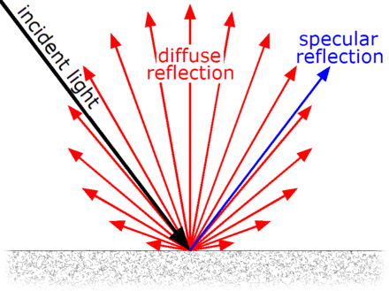
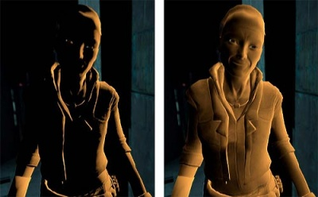
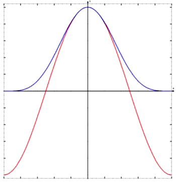

# ch04



Ambient + Diffuse + Specular + Emission

|                     |     |                |
| ------------------- | --- | -------------- |
| Ambient light       | 환경광 |                |
| Diffuse reflection  | 난반사 | 분산광, 여러방향 방향     |
| Specular reflection | 정반사 | 반사광, 입사각과 반대방향 |
| Emission Light      | 발광체 |                |

## [Diffuse reflection](https://en.wikipedia.org/wiki/Diffuse_reflection)(난반사)

[람베르트 모델](http://en.wikipedia.org/wiki/Lambertian_reflectance)


``` ref
난반사광 = 표면법선(normal)과 입사광이 이루는 각의 cos.

x = L과 N이 이루는 각도
|L| = 방향 벡터 A의 길이.
|N| = 방향 벡터 B의 길이.

dot(L, N) = cos(x) * |L| * |N|

// L과 N이 normalized됬을때라고 가정하면 벡터의 길이는 1이니
dot(L, N) = cos(x) * 1 * 1 = cos(x)
```


- 동일한 계산을 어느쪽에서도 할 수 있다면, 픽셀셰이더 보다는, 정점셰이더를 이용.
- 셰이더 프로그래밍시, 용도에 딱 맞는 시맨틱이 없는 경우가 종종 있는데, 이때 TEXCOORD를 사용하는게 일반적임.
- saturate() : 0이하의 값을 0으로, 1이상의 값을 1으로변경.(성능 영향없음)

## Specular Reflection(정반사광)

[퐁 모델 by Phong Bui-Tuong](http://en.wikipedia.org/wiki/Phong_reflection_model)


- 코사인 값을 거듭제곱함으로써 구함.
- reflect(입사광 방향벡터, 반사면 법선)

- [Blinn-Phong](http://en.wikipedia.org/wiki/Blinn%E2%80%93Phong_shading_model) : 퐁과 거의 비슷한 기법(현재도 많이 사용)
- [Oren-Nayar](http://en.wikipedia.org/wiki/Oren%E2%80%93Nayar_reflectance_model) : 표면의 거친 정도를 고려한 난반사광 조명기법.
- [Cook-Torrance](http://en.wikipedia.org/wiki/Specular_highlight#Cook.E2.80.93Torrance_model) : 포면의 거친 정도를 고려한 정반사광 조명기법.
  - <http://inst.eecs.berkeley.edu/~cs283/sp13/lectures/cookpaper.pdf>
- spherical harmonics lighting : 오프라인에서 간접광을 사전 처리한뒤, 실시간으로 이를 주변광으로 적용할 때 사용할 수 있음.
- Lyon/Blinn-Phong : Blinn-Phong 변형.
  - <http://jalnagakds.tumblr.com/post/25825085620/phong-blinn-phong>
  - <http://dicklyon.com/tech/Graphics/Phong_TR-Lyon.pdf>

----------------------------------

- Local illumination model : 직접광만 다루는 조명모델.
- Global illumination model : 간접광까지 다루는 조명모델


## half-lambert - [하프-람베르트](https://developer.valvesoftware.com/wiki/Half_Lambert)

왼쪽이 람베르트, 오른쪽이 하프-람베르트이다.



색의 진하기를 그래프로 보자면, 빨간색이 람베르트, 파란색이 하프-람베르트이다.



빨간색이 원점 0을 기준으로 그려진반면, 파란색은 그의 반인 0.5를 기준으로 그려진 것을 알 수 있다.

빨간색 그래프를 파란색 그래프와 같이 만들려면, 그래프를 높이를 반으로 줄이고, 줄어든 만큼, 기준점을 올리면 될 것이다.

`dot(-L, N) * 0.5 + 0.5`

거기에 그래프의 폭을 뾰족하게 만들려면, pow로 제곱해주면 될 일이다.

`pow( dot( -L, N) * 0.5 + 0.5, Power)`


-------------


``` cg
// Transforms normal from object to world space
inline float3 UnityObjectToWorldNormal( in float3 norm )
{
#ifdef UNITY_ASSUME_UNIFORM_SCALING
    return UnityObjectToWorldDir(norm);
#else
    // mul(IT_M, norm) => mul(norm, I_M) => {dot(norm, I_M.col0), dot(norm, I_M.col1), dot(norm, I_M.col2)}
    return normalize(mul(norm, (float3x3)unity_WorldToObject));
#endif
}
```