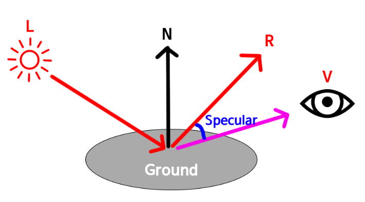

 # ch04

|     |                      |
| --- | -------------------- |
| L   | `L`ight : (빛)을 향한 방향 |
| V   | `V`iew : (눈)을 향한 방향  |
| N   | `N`ormal             |
| H   | `H`alf vector        |
| R   | `R`eflect            |

Ambient + Diffuse + Specular + Emission

|                     |     |                |
| ------------------- | --- | -------------- |
| Ambient             | 환경광 |                |
| Diffuse reflection  | 난반사 | 분산광, 여러방향 방향   |
| Specular reflection | 정반사 | 반사광, 입사각과 반대방향 |
| Emission            | 발광체 |                |

## [Diffuse reflection](https://en.wikipedia.org/wiki/Diffuse_reflection)(난반사)

[람베르트 모델](http://en.wikipedia.org/wiki/Lambertian_reflectance)


``` ref
난반사광 = 표면법선(normal)과 입사광이 이루는 각의 cos.

x = L과 N이 이루는 각도
|L| = 방향 벡터 A의 길이.
|N| = 방향 벡터 B의 길이.

dot(L, N) = cos(x) * |L| * |N|

// L과 N이 normalized됬을때라고 가정하면 벡터의 길이는 1이니
dot(L, N) = cos(x) * 1 * 1 = cos(x)
```

- 동일한 계산을 어느쪽에서도 할 수 있다면, 픽셀셰이더 보다는, 정점셰이더를 이용.
- 셰이더 프로그래밍시, 용도에 딱 맞는 시맨틱이 없는 경우가 종종 있는데, 이때 TEXCOORD를 사용하는게 일반적임.
- saturate() : 0이하의 값을 0으로, 1이상의 값을 1으로변경.(성능 영향없음)

## Specular Reflection(정반사광)

[퐁 모델 by Phong Bui-Tuong](http://en.wikipedia.org/wiki/Phong_reflection_model)




- 코사인 값을 거듭제곱함으로써 구함.

    ``` shader
    R = reflect(L, N) // 2* dot(N, V) * N - V
    specular = dot(R, V)
    ```
