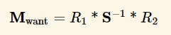
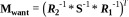
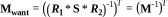

# ch07 - 법선맵

- 법선맵을 쓰는 이유?
- TBN이란?
- world-Normal 구하는 법?
- 노말맵 혹은 법선맵(tangent space)에서 g채널을 뒤집는 이유?

## 법선맵을 쓰는 이유

- 정점(vertex)로 디테일을 표시하면(폴리곤), 실시간으로 정점을 처리하는데 부하가 걸린다(주로 CPU).
- 셰이더 계산시 법선맵에서 가상의 정점을 생성해 빛을 계산하면 디테일을 살릴 수 있다.

## TBN

|        | T           | B           | N            |
| ------ | ----------- | ----------- | ------------ |
| TBN    | `T`angent   | `B`inormal  | `N`ormal     |
| Source | Tangent Map | cross(T, N) | obj's Normal |
| UV     | U           | V           |              |
| xyz    | x           | y           | z            |

``` shader
float3 tangentNormal = tex2D(NormalSampler, Input.mUV).xyz;
tangentNormal = normalize(tangentNormal * 2 - 1);

// TBN 행렬은 `WorldSpace normal to TangentSpace normal`;
float3x3 TBN = float3x3(normalize(Input.T), normalize(Input.B), normalize(Input.N));
| Tx Ty Tz |
| Bx By Bn |
| Nx Ny Nz |

// TBN은 직교행렬, 직교행렬의 역행렬은 전치행렬.
TBN = transpose(TBN); // `WorldSpace to TangentSpace` => `TangentSpace to WorldSpace`;
| Tx Bx Nx |
| Ty By Ny |
| Yz Bz Nz |

float3 worldNormal = mul(TBN, tangentNormal);
```

``` shader
// `mul(벡터, 메트릭스) =  mul( transpose(메트릭스), 벡터 )` 이므로,
// 다음과 같은 라인을
float3x3 TBN = float3x3(normalize(Input.T), normalize(Input.B), normalize(Input.N));
TBN = transpose(TBN); // TangentSpace to WorldSpace;
float3 worldNormal = mul(TBN, tangentNormal);

// 이렇게 줄여 쓸 수 도 있다.
float3x3 TBN = float3x3(normalize(Input.T), normalize(Input.B), normalize(Input.N));
float3 worldNormal = mul(tangentNormal, TBN);
```

### UNITY_NO_DXT5nm

DXT5nm이 아닌 경우(UNITY_NO_DXT5nm) 는 다음과 같은 공식을 썼으나,

``` shader
tangentNormal = normalize(tangentNormal * 2 - 1);
```

DXT5nm같은 경우 다음과 같이 구한다.

``` shader
float3 normalVal = float3(tangentNormal.a  * 2.0 - 1.0, tangentNormal.g * 2.0 - 1.0, 0.0);
normalVal.z = sqrt(1.0 - dot(normalVal, normalVal));
```

다음은 유니티 UnityCG.cginc에 있는 UnpackNormal 함수이다.

``` shader
// Unpack normal as DXT5nm (1, y, 1, x) or BC5 (x, y, 0, 1)
// Note neutral texture like "bump" is (0, 0, 1, 1) to work with both plain RGB normal and DXT5nm/BC5
fixed3 UnpackNormalmapRGorAG(fixed4 packednormal)
{
    // This do the trick
    packednormal.x *= packednormal.w;

    fixed3 normal;
    normal.xy = packednormal.xy * 2 - 1;
    normal.z = sqrt(1 - saturate(dot(normal.xy, normal.xy)));
    return normal;
}
inline fixed3 UnpackNormal(fixed4 packednormal)
{
#if defined(UNITY_NO_DXT5nm)
    return packednormal.xyz * 2 - 1;
#else
    return UnpackNormalmapRGorAG(packednormal);
#endif
}
```


| V   | color | channel       | bit |
| --- | ----- | ------------- | --- |
| X   | R     | a0, a1        | 16  |
|     |       | alpha indices | 48  |
| Y   | G     | color0,1      | 32  |
|     |       | color indices | 32  |
| Z   | B     | x             | 0   |

- xyzw, wy => _g_r => rg => xyn // r이 뒤로 있으므로, 한바퀴 돌려줘야함.
- `normal.xy = packednormal.wy * 2 - 1;` (0 ~ 1 => -1 ~ 1)
- `Z`는 쉐이더에서 계산. 단위 벡터의 크기는 1인것을 이용.(sqrt(x^2 + y^2 + z^2) = 1) `sqrt(1 - saturate(dot(normal.xy, normal.xy)))`


## Normal Scale Problem

- [Normal Transformation](https://paroj.github.io/gltut/Illumination/Tut09%20Normal%20Transformation.html)

오브젝트를 스케일시킬때 Normal의 변화의 문제

A라는 도형을 x에 대해서 2만큼 스케일 업하고 싶다고 가정하면,

|     | 정점     | x 스케일 | 노말       |
| --- | ------ | ----- | -------- |
| A   | (1, 1) | 1     | (1, 1)   |
| B   | (2, 1) | 2     | (2, 1)   |
| C   | (2, 1) | 2     | (0.5, 1) |


C처럼 x의 스케일 2배 됐다고, 노멀의 x값에 `곱하기` 2를 해서는 안된다. 역인 `나누기` 2 를 해야한다.

위치(position)에 대해서는 `world-Position = mul(obj-Position, M )`이 정상적으로 성립되었다.

하지만, `world-Normal = mul( obj-Normal, M )` 처럼 적용했을시 앞+선 `B`와 같은 문제가 발생한다.

월드행렬(M)식으로 나타내면


우리가 구하고 싶은 행렬을 M-want라 했을시 `world-Normal = mul(M-want, obj-Normal)`







즉 `M-want     = traspose(inverse(M))`.

DirectX기준 `row-major`에서의 메트릭스와 벡터의 인자 순서: `mul(벡터, 메트릭스) =  mul( transpose(메트릭스), 벡터 )`

아레 예는 `row-major` 기준으로 작성.

``` formula
M          = ObjectToWorld
inverse(M) = WorldToObject
M-want     = traspose(inverse(M))

world-Normal
= mul(obj-Normal   , M-want              )
= mul(obj-Normal   , traspose(inverse(M)))
= mul(inverse(M)   , obj-Normal          )
= mul(WorldToObject, obj-Normal          )
```

## 노말맵 혹은 법선맵(tangent space)에서 g채널을 뒤집는 이유

- 단위벡터의 크기가 1이지만, (-1, 0, 0)과 같은게 있으므로, 정규화된 법선벡터의 범위는 `-1...1`이다.
- 바이너리로 저장하기위해 범위를 `0...1`로 줄이려면 0.5를 곱하고 다시 0.5를 더해주면 된다.
- 셰이더에서 저장된 범위 `0...1`을 `-1...1`로 확장시키려면 2를 곱하고 1을 빼주면 `-1...1`의 범위로 확장된다.


노말맵에서 z값이 강한 경우가 있는데 그럼 이미지가 퍼렇게 보이면서 돌출이 아닌 움푹 패인듯한 느낌이 든다.

- 표면 안쪽으로 향하는(z의 값이 음수인) 경우가 없다.
  - 범위는 `0 ~ 1`
  - 바이너리 저장시 범위가 `0.5 ~ 1`로 변경되면서 0.5부터 값이 시작된다.
- 따라서 맵이 퍼렇게 보이면서, 돌출되는 부분이 이미지상 움푹들어간 모습처럼 보인다.

그러므로, g채널을 뒤집어주면 돌출된 부분을 아티스트가 쉽게 인지할 수 있다.

-------------

## 법선 맵핑과 비슷한 기타 고급기법

- 법선맵핑의 문제점 중 하나 : 측면에서 보면 입체감이 떨어진다.
- parallax mapping : normal map에다 height map을 이용하여 문제를 해결하려함.
- parallax occlusion mapping : + 인접픽셀과의 높이차를 구한후, 그에 따른 그림자를 입히는 기법.
- GPU gems, Shader X 참고.

## Reflect

- <https://blog.popekim.com/en/2014/02/11/intro-to-shader-04-lighting-part-2.html>

reflect의 첫번째 벡터는 꼭 normalize될 필요가 없다. 다른 곳에서 normalized된 값을 쓰지 않을 경우, 굳이 normalize 연산을 하지 말고, 그냥 reflect 함수를 쓰자.

``` cg
float3 reflect(float3 i, float3 n);

Parameters
i: Incidence vector.
n: Normal vector.

Description
Returns the reflectiton vector given an incidence vector i and a normal vector n. The resulting vector is the identical number of components as the two input vectors.

The normal vector n should be normalized. If n is normalized, the output vector will have the same length as the input incidence vector i.

- https://developer.download.nvidia.com/cg/reflect.html

float3 reflect( float3 i, float3 n )
{
  return i - 2.0 * n * dot(n,i);
}
```

-----------

TODO?
UniversalForward
LightweightForward
SRPDefaultUnlit

- https://t-tutiya.hatenablog.com/entry/2019/09/05/002548
- https://catlikecoding.com/unity/tutorials/scriptable-render-pipeline/custom-pipeline/