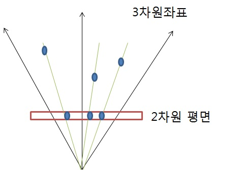

# 그림자 매핑

[게임 개발 포에버: 실시간 그림자를 싸게 그리자! 평면상의 그림자 ( Planar Shadow)](https://gamedevforever.com/326)

1. 그림자 만들기
2. 그림자 입히기

## 그림자맵 만들기

광원을 기준으로 물체의 상대적 거리(0 ~ 1)를 이미지로 저장.(0은 광원의 위치)

- 카메라를 빛(광원)의 위치에 두고 물체를 그린다.
- 픽셀 셰이더에서 빛으로부터 현재 픽셀까지의 깊이를 반환한다.
- 카메라의 렌더 타겟으로 텍스쳐를 설정(그림자맵)
- 카메라 렌더링 결과를 텍스쳐(그림자맵)에 저장.

``` ref
Object -> World -> View(Camera) -> Projection(Camera)
==>
Object -> World -> View(Light)  -> Projection(Light)
```



Light의 프로젝션으로 위치값을 구하면 `(Lx, Ly, Lz, Lw)`가 나온다. 이를 w가 1일때의 값을 구하면 `(Lx/Lw, Ly/Lw, Lz/Lw, 1)`을 얻을 수 있다.

(Lx/Lw, Ly/Lw, Lz/Lw, 1)를 (X, Y, Z, 1)이라 하면, X와 Y의 범위는 투영공간 평면 좌표의 범위 `-1 ~ 1`가 되며, Z의 값 Lz/Lw가 빛(카메라)와의 상대적 위치이며 범위는 `0 ~ 1`이 된다(0은 광원의 위치).

1에 가까울수록 빛으로 부터 멀어진것. 즉 그리지 말것이다. 따라서 그리지 말것을 지워주도록 클리어 칼라는 화이트(1, 1, 1)로 해주어야 한다.

``` shader
// VS
   Output.mPosition = mul(Input.mPosition,  gWorldMatrix);
   Output.mPosition = mul(Output.mPosition, lightViewMatrix);
   Output.mPosition = mul(Output.mPosition, gLightProjectionMatrix);

// PS
   float depth = Input.mClipPosition.z / Input.mClipPosition.w;
```

## 그림자 적용

- 카메라를 눈의 위치에 두고 물체를 그린다.
- 빛으로부터 현재 픽셀까지의 깊이를 그림자 맙에 담겨 있는 결과와 비교.
  - 현재 깊이값이 그림자 맵의 깊이값보다 크면 그림자를 씌운다.

투영공간 (Lx/Lw, Ly/Lw, Lz/Lw, 1)를 (X, Y, Z, 1)이라 했을때, Z는 현재 depth.
X, Y는 투영공간의 좌표이므로, UV좌표 변환하여 UV좌표를 얻는다.

``` ref
투영공간의 XY좌표
(-1,  1)        ( 1,  1)
    +------------+
    |            |
    |            |
    |            |
    |            |
    +------------+
(-1, -1)       ( 1, -1)

텍스쳐 UV좌표
(0, 0)        (0, 1)
    +------------+
    |            |
    |            |
    |            |
    |            |
    +------------+
(1, 0)       (1, 1)

XY -> UV
U =  X * 0.5f + 0.5f;
V = -Y * 0.5f + 0.5f;

UV -> XY
X =  U * 2 - 1;
Y = -V * 2 + 1;
```

저장된 텍스쳐에서 UV좌표를 이용하여 깊이값을 구하고, 이전에 구한 깊이값과 현재의 오브젝트의 깊이값을 비교하여 그림자를 그릴지 말지를 정의한다.

``` shader
VS
   Output.mClipPosition = mul(worldPosition, lightViewMatrix);
   Output.mClipPosition = mul(Output.mClipPosition, gLightProjectionMatrix);

PS
   float currentDepth = Input.mClipPosition.z / Input.mClipPosition.w;
   float2 uv = Input.mClipPosition.xy / Input.mClipPosition.w;
   uv.y = -uv.y;
   uv   =  uv * 0.5f + 0.5f;

   float shadowDepth = tex2D(ShadowSampler, uv).r;

   // 현재의 Depth가 그림자맵의 Depth보다 크다는 것은 광원보다 뒤에 있다는 것이며, 그림자가 드리워야 한다는 의미.
   if (currentDepth > shadowDepth + 임의값)
   {
      rgb *= 0.5f;
   }
```

## 고급기법

### casecade shadow map 케스케이드 그림자맵

그림자맵핑의 해상도 문제를 해결하기 위해, 거리별 여러개의 그림자맵을 만드는 기법(LOD와 비슷)

### percentage closer filtering 퍼센티지 클로저 필터링

그림자의 외곽선을 부드럽게 필터링 해주기 위해 사용. bilinear필터와 개념은 비슷. 그래픽 하드웨어가 R32F 텍스쳐의 bilinear필터를 지원안할시, 비슷하게 흉내내려는 시도가 PCF. 하드웨어 자체가 PCF를 지원해주는 그래픽카드도 있음.

### variance shadow map

하드웨어 필터링이 가능하도록 깊이값을 저장하는 방법. 보통 2채널로 나눠서 저장. 그림자가 겹칠시, 빛이 새어 들어오는 부작용이 생기기도 함.

--------------------------------------------------------------------------------------

## Homogeneous Coordinates

ref: [투영기하, 동차좌표계](https://carstart.tistory.com/180)

어떤목적을 위하여 한 차원의 좌표(n) 을 한차원 추가된 좌표  (n+1)로 표현을 하는 것을 동차 좌표계라 한다.

예를 들자면
3차원 좌표 (x, y, z)는
4차원 좌표 (x, y, z, w)형태로 표현 한다는 것이다.
기본적인 성분 x y z 에 w가 추가된것으로 3D 상에서는 x/w y/w z/w로 나타낸다

투영행렬에서 동차좌표를 사용하는 이유가 무엇인가요?

시점으로 보이는 점들의 위치가 중요한게 아니라 시점으로 부터 방향이 중요하기 때문이다.

월드공간과 카메라공간에서는 w값이 항상 1이기 때문에 변화가 없지만
투영공간에서는 w값이 카메라 공간에서의 카마레위치에서 부터 정점사이 거리이기 때문에 z값에 따라 정점의 위치와 크기가 변환되는 것임을 짐작할 수 있다.

## 렌더몽키 gLightViewMatrix

gLightViewMatrix 를 DirectX상에서 넘겨주어야 하나 렌더몽키에선 없으므로 ps에서 만든다.


``` shader
   float4x4 lightViewMatrix = gLightViewMatrix;

   float3 dirZ = -normalize(gWorldLightPosition.xyz);
   float3 up = float3(0, 1, 0);
   float3 dirX = cross(up, dirZ);
   float3 dirY = cross(dirZ, dirX);

   lightViewMatrix = float4x4(
      float4(dirX, -dot(gWorldLightPosition.xyz, dirX)),
      float4(dirY, -dot(gWorldLightPosition.xyz, dirY)),
      float4(dirZ, -dot(gWorldLightPosition.xyz, dirZ)),
      float4(0, 0, 0, 1)
   );
   lightViewMatrix = transpose(lightViewMatrix);

   Output.mPosition = mul(Input.mPosition, gWorldMatrix);
   Output.mPosition = mul(Output.mPosition, lightViewMatrix);
   Output.mPosition = mul(Output.mPosition, gLightProjectionMatrix);
```
