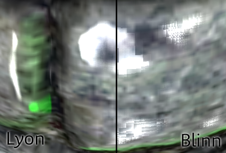

# lighting model

난반사 - 확산 - diffuse

|                |                           |
| -------------- | ------------------------- |
| Lambert        |                           |
| Half Lambert   |                           |
| Oren-Nayer     | 표면의 거친 정도를 고려한 난반사광 조명기법. |
| Disney Diffuse |                           |

정반사 - 반사 - reflect

|                  |                           |
| ---------------- | ------------------------- |
| Phong            |                           |
| Blinn Phong      |                           |
| Lyon             |                           |
| Torrance-Sparrow |                           |
| Trowbridge-Reitz |                           |
| Cook Torrance    | 포면의 거친 정도를 고려한 정반사광 조명기법. |
| GGX              | Cook Torrance 변종          |

## [half-lambert](https://developer.valvesoftware.com/wiki/Half_Lambert)

왼쪽이 람베르트, 오른쪽이 하프-람베르트이다.


색의 진하기를 그래프로 보자면, 빨간색이 람베르트, 파란색이 하프-람베르트이다.


빨간색이 원점 0을 기준으로 그려진반면, 파란색은 그의 반인 0.5를 기준으로 그려진 것을 알 수 있다.

빨간색 그래프를 파란색 그래프와 같이 만들려면, 그래프를 높이를 반으로 줄이고, 줄어든 만큼, 기준점을 올리면 될 것이다.

`dot(-L, N) * 0.5 + 0.5`

거기에 그래프의 폭을 뾰족하게 만들려면, pow로 제곱해주면 될 일이다.

`pow( dot( -L, N) * 0.5 + 0.5, Power)`


## [Blinn-Phong - by Jim Blinn](http://en.wikipedia.org/wiki/Blinn%E2%80%93Phong_shading_model)

 퐁과 거의 비슷한 기법(현재도 많이 사용)

- normalize(V + L);
- specular = dot(H, N)

    

## [Oren-Nayar](http://en.wikipedia.org/wiki/Oren%E2%80%93Nayar_reflectance_model)

- <https://kblog.popekim.com/2011/11/blog-post_16.html>
- <https://kblog.popekim.com/2011/11/oren-nayar.html>
- <http://hovamoon.egloos.com/1328549>

## [Cook-Torrance](http://en.wikipedia.org/wiki/Specular_highlight#Cook.E2.80.93Torrance_model)

<http://inst.eecs.berkeley.edu/~cs283/sp13/lectures/cookpaper.pdf>

## spherical harmonics lighting 

오프라인에서 간접광을 사전 처리한뒤, 실시간으로 이를 주변광으로 적용할 때 사용할 수 있음.

## Lyon/Blinn-Phong : Blinn-Phong 변형

일반 Blinn-Phong에서 NormalMap을 적용시키려면 NormalMap을 더하고 나눈다음 Normalize시켜줘서 -1~1의 값을 만들어 주도록 추가 작업이 들어감.



``` shader
float Lyon(float3 N, float3 V, float3 L)
{
    float3 H = normalize(L + V);
    float3 difference = H - N;
    float xs = saturate(dot(difference, difference) * specPower / 2);
    return pow(1 - xs, 3);
}
```

- <http://jalnagakds.tumblr.com/post/25825085620/phong-blinn-phong>
- <http://dicklyon.com/tech/Graphics/Phong_TR-Lyon.pdf>

## Cook Torrance

Robert L. Cook 과 Kenneth E. Torrance

## GGX

- <https://learnopengl.com/PBR/Theory>
- <https://lifeisforu.tistory.com/306>

-------------


``` cg
// Transforms normal from object to world space
inline float3 UnityObjectToWorldNormal( in float3 norm )
{
#ifdef UNITY_ASSUME_UNIFORM_SCALING
    return UnityObjectToWorldDir(norm);
#else
    // mul(IT_M, norm) => mul(norm, I_M) => {dot(norm, I_M.col0), dot(norm, I_M.col1), dot(norm, I_M.col2)}
    return normalize(mul(norm, (float3x3)unity_WorldToObject));
#endif
}
```


# REF

* http://3dapi.com/bs25_shader1/
* https://en.wikipedia.org/wiki/Blinn%E2%80%93Phong_shading_model

subsurface scattering

lambert
half-lambert
phong
blinn-phong
lyon

Phong reflection model
Blinn-Phong (Blinn D1, Phong) specular distribution
Lyon halfway method 1 (for k=2 and D = H* – L)
Trowbridge-Reitz (Blinn D3) specular distribution
Torrance-Sparrow (Blinn D2, Gaussian) specular distribution

Bidirectional Reflectance Distribution Function (BRDF) describes
http://people.csail.mit.edu/wojciech/BRDFValidation/index.html

Oren–Nayar (Rough opaque diffuse surfaces)
Minnaert
Cook–Torrance (microfacets)
He et al.

ashikihmin
lafortune
Ward anisotropic


Strauss
Translucent


https://msdn.microsoft.com/en-us/library/windows/desktop/bb509647.aspx

# Techniques
* Phong
* Lambert
* Half Lambert

* Blinn-Phong: a technique that is very similar to Phong.
* Oren-Nayar: a diffuse lighting technique that takes account of the roughness of a surface.
* Cook-Torrance: a specular lighting technique that takes account of the roughness of a surface.
* Spherical Harmonics Lighting: once indirect lighting is pre-calculated offline, it can be applied in real-time.


# PBS(physical based shader)
Oren - Nayar - 거칠게하기 - phong은 너무 매끈거림
Blinn - Phong Specuar
Anisotropic
Fresnel effect : Snell's Law
IBL(image based light)