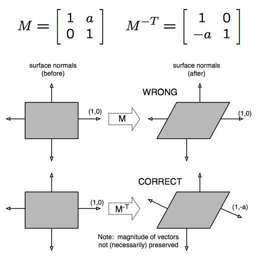

# TODO: 난반사(diffuse)와 정반사(specular)


## implement lambert

이제 한번 구현해 보자.

구현하기전에 생각해 볼 것은,

1. 물체의 `N`ormal 과 normalize된 `L`ight-방향 백터를 구해야 한다.
2. vertex shader단에서 해결이 될 것인지, vertex shader 보다 부하가 큰 pixel shader단에서 구현할 것인지 판단해야 한다.

### matrix

* UNITY_MATRIX_M - `M`odel transform. `unity_ObjectToWorld` 와 같음.
* UNITY_MATRIX_V - world space 에서 local `V`iew space로 변환.
* UNITY_MATRIX_P - view space 에서 `P`rojection space로 변환.
* unity_WorldToObject - `unity_ObjectToWorld`의 역행렬.

### Normal, Light

light의 방향은, `물체의 월드좌표 - 빛의 월드좌표`를 한뒤 normalize를 시켜주면 된다.
문제는 물체의 normal인데, 자세히 살펴보도록 하자.

`model matrix`를 `inverse`시키고 `transpose`시키면 `normal matrix`를 얻을 수 있다. 중간에 과정이 누락됬을시, 처음 겉에서 봤을시 문제없어보이더라도, 물체가 변형됬을때 normal값이 정상적이지 않은 값이 들어가게 될 것이다.

``` ref
mat3 normal_matrix = transpose(inverse(mat3(modelview_matrix)))
```




``` shader
float4x4 normalMatrix

// inverse는 지원하지 않는 함수.
 = transpose(inverse(UNITY_MATRIX_M))
 = transpose(inverse(unity_ObjectToWorld))

// tranpose는 호출 비용이 있다.
 = transpose(unity_WorldToObject)
```

``` shader
float3 worldNormal

= mul(transpose(unity_WorldToObject), float4(normal.xyz, 0)).xyz

// mul(tranpose(matrix), vector) = mul(vector, matrix) 임으로
= mul(float4(normal.xyz, 0), unity_WorldToObject).xyz

// float4로 늘리는 것보다, float3x3으로 캐스팅하면 성능 저하도 없다.
= mul(normal.xyz, (float3x3)unity_WorldToObject)

worldNormal = normalize(worldNormal);
```

``` shader
float3 worldNormal = mul(Input.mNormal, (float3x3)unity_WorldToObject);
worldNormal = normalize(worldNormal);
```

mul(matrix, vector) == mul(vector, transpose(matrix))


### light dir

[SL-UnityShaderVariables](https://docs.unity3d.com/Manual/SL-UnityShaderVariables.html)

``` shader
float4 worldPosition = mul(UNITY_MATRIX_M, Input.mPosition);
float3 lightDirection = normalize(worldPosition.xyz - _WorldSpaceLightPos0.xyz);
```

### vertex shader, pixel shader

lambert shader 를 구현하기 위해서는 빛의 방향, 물체의 방향이 필요하니, vertex shader 단에서도 충분히 구현할 수 있다.

```cg
// Tags에 LightMode가 설정된 것에 주의.
// ref: https://docs.unity3d.com/Manual/SL-PassTags.html
Tags{ "LightMode" = "ForwardAdd" }

CGPROGRAM

#pragma vertex vs_main
#pragma fragment ps_main

struct VS_INPUT
{
    float4 mPosition : POSITION;
    float4 mNormal : NORMAL;
};

struct VS_OUTPUT
{
    float4 mPosition : SV_Position;
    float3 mDiffuse : TEXCOORD1;
};

VS_OUTPUT vs_main(VS_INPUT Input)
{
    VS_OUTPUT Output;

    float4 worldPosition = mul(UNITY_MATRIX_M, Input.mPosition);
    float3 lightDirection = normalize(worldPosition.xyz - _WorldSpaceLightPos0.xyz);

    float3 worldNormal = normalize(mul(Input.mNormal.xyz, (float3x3)unity_WorldToObject));

    Output.mDiffuse = dot(worldNormal, -lightDirection);
    Output.mPosition = mul(UNITY_MATRIX_VP, worldPosition);

    return Output;
}

float4 ps_main(VS_OUTPUT Input) : SV_Target
{
    float3 diffuse = saturate(Input.mDiffuse);
    return float4(diffuse, 1);
}

ENDCG
```


Directional Light를 쓸 경우 `Tags{ "LightMode" = "ForwardBase" }`를 쓰는 게 좋다. 다만 lightDirection을 구할시 물체의 위치와 상관없이 `_WorldSpaceLightPos0`자체를 normalize시키면 방향을 구할 수 있다.

```cg
float3 lightDirection = normalize(_WorldSpaceLightPos0.xyz);
```

https://docs.unity3d.com/Manual/SL-Pass.html


### Phong Model

* L : `L`ight(빛)을 향한 방향
* V : `V`iew(눈)을 향한 방향
* N : `N`ormal
* H : `H`alf way
* R : `R`eflect - `N`을 기준으로, `L`을 반사한 방향.

R = 2(dot(L, N))N - L
phong = power(dot(V, R), 100)

복잡하니 의사코드를 먼저 작성해보고, 실제 코드로 변환해 보는 방법을 취하겠다.

일단 LightMode를 명시해주고,

``` shader
Pass
{
  Tags{ "LightMode" = "ForwardAdd" }

  CGPROGRAM
  ENDCG
}
```

CG 코드를 작성한다.

``` shader
#pragma vertex vs_main
#pragma fragment ps_main

struct VS_INPUT
{
   float4 mPosition : POSITION;
   float4 mNormal : NORMAL;
};

struct VS_OUTPUT
{
   float4 mPosition : SV_Position;
   // float3 mDiffuse : TEXCOORD1;
   float3 V : TEXCOORD2;
   float3 R : TEXCOORD3;
};

VS_OUTPUT vs_main(VS_INPUT Input)
{
   VS_OUTPUT Output;

   // 변환 위치 = 월드 행렬 * 정점 위치
   float4 worldPosition = mul(UNITY_MATRIX_M, Input.mPosition);

   // 빛 벡터 = normalize(변환 위치 - 빛 위치)
   float3 L = normalize(worldPosition.xyz - _WorldSpaceLightPos0.xyz);

   // 변환 법선 = 정점 법선 * 월드 행렬의 회전 행렬
   float3 N = normalize(mul(Input.mNormal.xyz, (float3x3)unity_WorldToObject));

   // 시선 벡터 = normalize(카메라 위치 - 변환 위치)
   Output.V = normalize(_WorldSpaceCameraPos.xyz - worldPosition.xyz);

   // 반사 벡터 = 2 * dot(빛의 방향, 변환 법선) * 변환 법선 - 빛의 방향
   // = reflect(L, N)
   Output.R = reflect(L, N);

   Output.mPosition = mul(UNITY_MATRIX_VP, worldPosition);

   return Output;
}

float4 ps_main(VS_OUTPUT Input) : SV_Target
{
  float3 V = normalize(Input.V);
  float3 R = normalize(Input.R);

  // 퐁 반사의 세기 = dot(시선 벡터, 반사 벡터)^Power
  float3 phong_specular = pow(saturate(dot(V, R)), 20);

  return float4(phong_specular, 1);
}


```

## Jim Blinn

퐁 반사는 정면으로 반사하는 빛에 대해서 현실 세계를 잘 표현하지만 그림과 같이 거의 수평면으로 입사되는 빛에 대해서 더 넓은 영역의 하이라이트(Highlight)를 만들고 반사의 경계를 만들어 냅니다.

또한 실 세계에서 거의 수평면으로 입사한 빛은 오히려 더 강한 Specular를 만들고, 이를 표현하려면 시선 벡터 방향으로 반사 벡터를 좀 더 움직여야 합니다. 이것을 "off-specular peak" 이라 합니다.

Blinn-Phong 반사는 퐁 반사 모델을 수정해서 좀 더 현실 세계의 정 반사 효과를 표현한 조명 모델이라 할 수 있습니다. Blinn-Phong 반사는 다음 그림과 같이 퐁 반사의 반사 벡터 대신 Half 벡터를 사용합니다.

Phong과 별반 차이가 없어보이긴 하지만 물체 표면을 따라서 늘어져서 보인다는 특징이 있습니다.

아시다시피 게임에서 널리 쓰이는 Specular 모델인 Phong 셰이딩은 그다지 물리적으로 정확한 모델은 아닙니다. 실제 Specular는 방향성을 갖고 있지만 Phong 셰이딩은 항상 원형 형태로 Specular가 생기거든요.

근데 Blinn-Phong 셰이딩은 두가지 문제를 갖고 있습니다.
Phong 셰이더보다 비쌉니다!
Normalmap이 깨져보이게 Specular가 생깁니다!
실제 폴리곤 모델인 경우 생기지 않는 문제지만 Normalmap을 사용하게 되면 Specular가 깨져서 생기게 됩니다. 이게 무슨 소리냐면

그림에서 보시다시피 Flickering 현상이 나타납니다. 이건 Normalmap이 0~1까지의 값만을 갖으면서 생기는 문제로, Blinn-Phong 셰이더에서 이걸 해결하려면 Normalmap을 한번 더해주고 그걸 다시 나눈다음에 노멀라이즈 해줘서 -1~1의 값을 갖도록 만들어주면 됩니다.

그런데 가뜩이나 Phong 셰이더보다 무거운데 Normalmap까지 처리해주느라 더 무거워지는 일이 생기는데 이걸 해결한 유사 Blinn-Phon 셰이딩 모델이 있습니다. 심지어 Phong 셰이더보다도 가볍습니다!

- https://jalnagakds.tumblr.com/post/25825085620/phong-%EC%85%B0%EC%9D%B4%EB%8D%94%EB%B3%B4%EB%8B%A4-%EC%8B%BC-%EC%9C%A0%EC%82%AC-blinn-phong-%EC%85%B0%EC%9D%B4%EB%94%A9-%EB%AA%A8%EB%8D%B8

- http://theinstructionlimit.com/isotropic-specular-reflection-models-comparison


Lyon-Phong

성능
https://en.wikipedia.org/wiki/Blinn%E2%80%93Phong_shading_model#Efficiency

- phong - R : 반사 벡터 = reflect(L, N)
- blinn - H : Half 벡터 = normalize(V + L)

``` shader
#pragma vertex vs_main
#pragma fragment ps_main

struct VS_INPUT
{
   float4 mPosition : POSITION;
   float4 mNormal : NORMAL;
};

struct VS_OUTPUT
{
   float4 mPosition : SV_Position;
   // float3 mDiffuse : TEXCOORD1;
   float3 N : TEXCOORD2;
   float3 H : TEXCOORD3;
};

VS_OUTPUT vs_main(VS_INPUT Input)
{
   VS_OUTPUT Output;

   // 변환 위치 = 월드 행렬 * 정점 위치
   float4 worldPosition = mul(UNITY_MATRIX_M, Input.mPosition);

   // 빛 벡터 = normalize(변환 위치 - 빛 위치)
   float3 L = normalize(worldPosition.xyz - _WorldSpaceLightPos0.xyz);

   // 변환 법선 = 정점 법선 * 월드 행렬의 회전 행렬
   Output.N = normalize(mul(Input.mNormal.xyz, (float3x3)unity_WorldToObject));

   // 시선 벡터 = normalize(카메라 위치 - 변환 위치)
   float3 V = normalize(_WorldSpaceCameraPos.xyz - worldPosition.xyz);

   // Half 벡터 = normalize(시선 벡터 + 빛의 방향 벡터)
   Output.H = normalize(V + L);

   Output.mPosition = mul(UNITY_MATRIX_VP, worldPosition);

   return Output;
}

float4 ps_main(VS_OUTPUT Input) : SV_Target
{
  float3 N = normalize(Input.N);
  float3 H = normalize(Input.H);

  // Blinn-Phong 반사 세기 = dot(법선 벡터, Half 벡터)^Power
  float3 blinn_specular = pow(saturate(dot(N, H)), 20);

  return float4(blinn_specular, 1);
}
```
