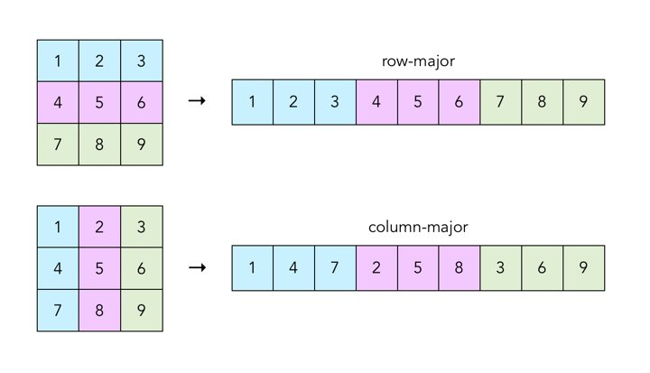

# 빨강 셰이더

유니티는 [ShaderLab][unity: SL-Shader]이라는 자체 쉐이더 언어를 쓴다.
다만, 일반적으로 쓰는 [Cg]/[HLSL], [GLSL] 쉐이더 코드를 중간에 넣기도한다.
보통 GLSL코드는 유니티에서 잘 쓰이지 않는 경향이 있으며, 책의 예제와 호환성을 위해 HLSL코드로 작성한다.

(기존에는 CGPROGRAM을 시작으로 CG로 작성하였으나, 새로운 유니티 렌더링파이프라인에서는 HLSLPROGRAM을 권장한다.)

## 기본 쉐이더 모습

유니티 [shader][unity: SL-Shader]는 다음과 같은 구조를 지닌다.

``` shader
Shader "#{shader-name}"
{
    [Properties]
    Subshaders
    [Fallback]
    [CustomEditor]
}
```

[Subshader][unity: SL-Subshader]

``` shader
SubShader
{
    // Tags
    // CommonState
    Pass
    {
    }
    // Passdef ...
}
```

[Pass][unity: SL-Pass], [Tags][unity: SL-PassTags]

``` shader
Pass
{
    // Name "#{pass-name}"
    // Tags
    // RenderSetup
}
```

## 3D Pipeline


복잡해보이나, 간단하게 Vertex Shader, Pixel Shader만 봐보자.

Vertex들 => Vertex Shader => Rasterizer => Pixel Shader

삼각형을 예로들어, 삼각형은 3개의 Vertex로 구성되어 있다. 각 Vertex마다 VertexShader를 돌리고,

Rasterizer가 그 결과를 받아, Vertex 간에 라인알고리즘(ex) [Bresenham’s line algorithm](https://en.wikipedia.org/wiki/Bresenham%27s_line_algorithm))을 적용하여 선으로된 삼각형을 그리고, 위에서 아레로 가로선을 그리며 선으로된 삼각형 안의 pixel을 체워주게 된다.

Rasterizer를 거쳐 체워진 각 Pixel에 대해 PixelShader가 돌아가게 된다.

## vertex와 pixel

3D오브젝트는 여러점(`vertex`)으로 구성되어있고, 화면에 `pixel`로 표시된다.

- vertex shader는 오브젝트의 각 vertex마다 실행되어, pixel shader에서 쓸 수 있는 정보로 가공한다.
- pixel shader는 화면에 뿌려지는 오브젝트의 각 pixel마다 수행되며, 띄엄띄엄 있는 vertex보다 pixel이 많으니 pixel shader의 부하 역시 vertex shader보다 크다.

## vertex/pixel shader

쉐이더를 작성해보자.

대충 모양은 다음과 같다.

``` shader
Shader "popo/ch02"
{
    SubShader
    {
        Pass
        {
            Pass
            {
                HLSLPROGRAM
                ENDHLSL
            }
        }
    }
}
```

이제부터는 CGPROGRAM// ENDCG안쪽만 보도록 하자.

``` shader
#pragma fragment ps_main

float4 ps_main() : SV_Target
{
    return float4(1.0f, 0.0f, 0.0f, 1.0f);
}
```

보통이라면 위에처럼 코드를짜면 빨강색이 표시가 될텐데, 유니티는 다음과 같이 vertex/shader쌍을 원한다.

``` ref
Both vertex and fragment programs must be present in a shader snippet. Excluding it from compilation.
```

그래서 다음과 같이 짜보면 물체가 보이지도 않는다.

``` hlsl
#pragma vertex vs_main
#pragma fragment ps_main

void vs_main()
{
}

float4 ps_main() : SV_Target
{
    return float4(1.0f, 0.0f, 0.0f, 1.0f);
}
```

물체의 vertex정보가 없기에 무얼 보여줘야할지 모르는 것이다. 좀 보여주도록 하자.

``` hlsl
#pragma vertex vs_main
#pragma fragment ps_main

struct VS_INPUT
{
   float4 mPosition : POSITION;
};

struct VS_OUTPUT
{
   float4 mPosition : SV_Position;
};

VS_OUTPUT vs_main(VS_INPUT Input)
{
    VS_OUTPUT Output;
    Output.mPosition = mul(UNITY_MATRIX_M, Input.mPosition);
    Output.mPosition = mul(UNITY_MATRIX_V, Output.mPosition);
    Output.mPosition = mul(UNITY_MATRIX_P, Output.mPosition);
    return Output;
}

float4 ps_main(VS_OUTPUT Input) : SV_Target
{
    return float4(1.0f, 0.0f, 0.0f, 1.0f);
}
```

이제 빨간색으로 채워진 것이 보일것이다.

[hlsl-Semantics](https://msdn.microsoft.com/en-us/library/windows/desktop/bb509647)

- VertexShader에서 쓰이는 VS_INPUT의 `POSITION`은 object space의 Vertex position이며 float4 형이다.
- PixelShader에서 쓰이는 VS_OUTPUT(Pixel Shader입장에서 보면 이놈이 Input이다.)의 `SV_Position`은 screen space의 pixel position이며 float2 형이다.

``` shader
    Output.mPosition = mul(UNITY_MATRIX_M, Input.mPosition);
    Output.mPosition = mul(UNITY_MATRIX_V, Output.mPosition);
    Output.mPosition = mul(UNITY_MATRIX_P, Output.mPosition);
```

## [Row and column major order](https://en.wikipedia.org/wiki/Row-_and_column-major_order)

matrix를 표현하는데 있어 row major 방식과 column major 방식이 있다.



|             |              |                |
|-------------|--------------|----------------|
|OpenGL       | column-major | column vectors |
|GLSL         | column-major | column vectors |
|HLSL         | column-major | row vectors    |
|DirectX Math | row-major    | row vectors    |
|Unity3D      | row-major    | row vectors    |

column-major(HLSL)기반인 포프책에서는 다음과 같이 mul(vector, matrix)를 하였으나,

``` hlsl
Output.mPosition = mul(Input.mPosition, gWorldMatrix);
Output.mPosition = mul(Output.mPosition, gViewMatrix);
Output.mPosition = mul(Output.mPosition, gProjectionMatrix);
```

Unity3D에서는 row-major기반임으로 다음과 같이 mul(matrix, vector)를 해주어야 한다.

``` hlsl
Output.mPosition = mul(UNITY_MATRIX_M, Input.mPosition);
Output.mPosition = mul(UNITY_MATRIX_V, Output.mPosition);
Output.mPosition = mul(UNITY_MATRIX_P, Output.mPosition);
```

matrix의 정렬방식을 지정하는 pack_matrix가 있다. 단, Unity 쉐이더 코드에서는 먹히지 않는다.

``` hlsl
#pragma pack_matrix(column_major)
```

``` hlsl
mul(matrix, vector) == mul(vector, transpose(matrix))
```

## 지금은 SurfaceShader는 무시

- <https://docs.unity3d.com/Manual/SL-SurfaceShaders.html>

체워넣을 수 있는 쉐이더에는 SurfaceShader랑, vertex/pixel Shader가 있다. Surface는 vertex/pixel shader를 좀 더 편하게 작성할 수 있도록, 유니티가 프리셋을 제시해 준 것이다. 개인적으로는, 이게 있어서 코드 중복성을 줄이는 편리함을 얻게되는대신 지정한 프리셋이 뭔지 알아야하는 2중고를 느껴 별로이다. 하지만 SurfaceShader로 작성된 코드도 많이 보여 무시할 수 없으니, 일단은 vertex/pixel shader를 익힌후 메뉴얼을 뒤지면서 그때그때 공부하는 걸로 하고 넘어가자.

[unity: SL-Shader]: https://docs.unity3d.com/Manual/SL-Shader.html
[unity: SL-SubShader]: https://docs.unity3d.com/Manual/SL-SubShader.html
[unity: SL-Pass]: https://docs.unity3d.com/Manual/SL-Pass.html
[unity: SL-PassTags]: https://docs.unity3d.com/Manual/SL-PassTags.html
[Cg]: https://en.wikipedia.org/wiki/Cg_(programming_language)
[HLSL]: https://en.wikipedia.org/wiki/High-Level_Shading_Language
[GLSL]: https://en.wikipedia.org/wiki/OpenGL_Shading_Language
