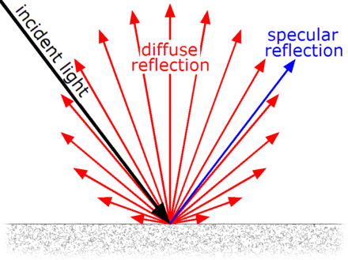
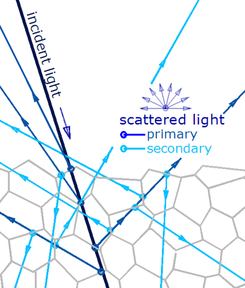
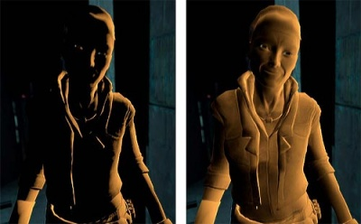
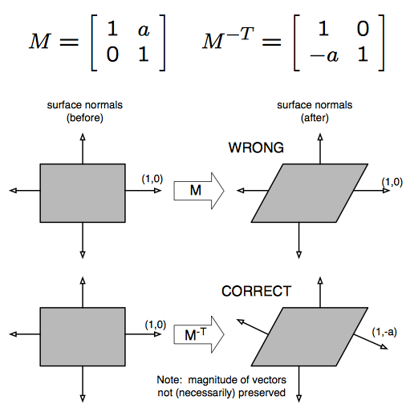
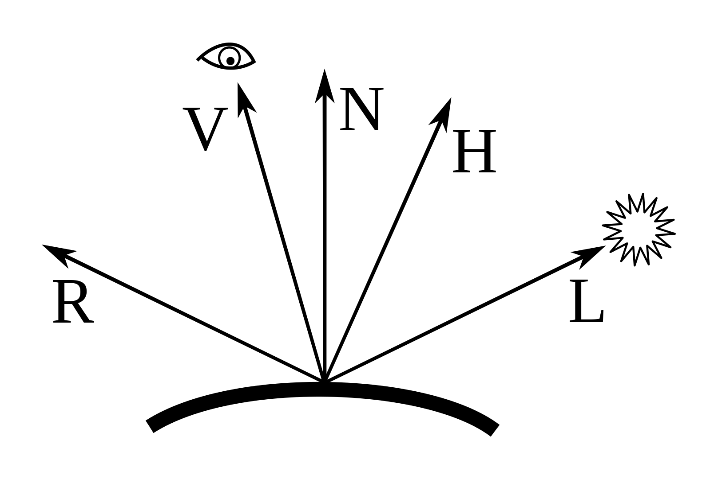

# 난반사(diffuse)와 정반사(specular)


## [Diffuse reflection](https://en.wikipedia.org/wiki/Diffuse_reflection)


일단, 많이들 쓰는 난반사로 적어놨는데, 분산반사가 더 어울리지 않을까 싶다.

diffuse는 표면의 거치면 강하다고 나와있다.
거칠다는 표현보다는, 물체를 이루는 결정이 고르지 않을때 더 많은 분산반사가 이루어 진다고 하면 조금 더 올바른 표현이지 않을까 싶다.

빛이 물체를 이루고 있는 결정을 통과할때, 결정끼리 맞닿아 있는 경계를 지날때 반사가 이루어지며, 결정이 고르지 않을때 반사가 좀 더 확산되는 것이다.



시멘트같은게 결정이 고르지 않을 것인데, 역시 시멘트 같은걸로 물체를 만들면, 거칠어지니 거칠기와 바로 연관지은듯 보인다.


## lambert diffuse - [람베르트 모델](http://en.wikipedia.org/wiki/Lambertian_reflectance)
람베르트가 확산모델을 다음과 같은 확산 공식을 제시하였다.

dot(A, B) = cos(x) * |A| * |B|, A와 B가 normalized됬을때라고 가정하면 벡터의 길이는 1이니, dot(A, B) = cos(x)가 된다.

```
dot(`N`ormal, -(normalized `L`ight-directed vector))
 = cos(a)
```

object의 `N`ormal을 구하고, `L`ight의 방향을 normalized시킨 것을 내적시키면 된다.

단, 내적시키러면 벡터의 밑둥이 맞닿아 있어야 함으로, `L`을 `-L`로 반대방향으로 꺽어준다.


## half-lambert - [하프-람베르트](https://developer.valvesoftware.com/wiki/Half_Lambert)

왼쪽이 람베르트, 오른쪽이 하프-람베르트이다.



색의 진하기를 그래프로 보자면, 빨간색이 람베르트, 파란색이 하프-람베르트이다.


빨간색이 원점 0을 기준으로 그려진반면, 파란색은 그의 반인 0.5를 기준으로 그려진 것을 알 수 있다.

빨간색 그래프를 파란색 그래프와 같이 만들려면, 그래프를 높이를 반으로 줄이고, 줄어든 만큼, 기준점을 올리면 될 것이다.

```
dot( -`L`, `N` ) * 0.5 + 0.5
```

거기에 그래프의 폭을 뾰족하게 만들려면, pow로 제곱해주면 될 일이다.

```
pow( dot( -`L`, `N` ) * 0.5 + 0.5, `power`)
```

## implement lambert

이제 한번 구현해 보자.

구현하기전에 생각해 볼 것은,
1. 물체의 `N`ormal 과 normalize된 `L`ight-방향 백터를 구해야 한다.
2. vertex shader단에서 해결이 될 것인지, vertex shader 보다 부하가 큰 pixel
shader단에서 구현할 것인지 판단해야 한다.


### matrix
* UNITY_MATRIX_M - `M`odel transform. `unity_ObjectToWorld` 와 같음.
* UNITY_MATRIX_V - world space 에서 local `V`iew space로 변환.
* UNITY_MATRIX_P - view space 에서 `P`rojection space로 변환.
* unity_WorldToObject - `unity_ObjectToWorld`의 역행렬.

### normal, light
light의 방향은, `물체의 월드좌표 - 빛의 월드좌표`를 한뒤 normalize를 시켜주면 된다.
문제는 물체의 normal인데, 자세히 살펴보도록 하자.

`model matrix`를 `inverse`시키고 `transpose`시키면 `normal matrix`를 얻을 수 있다. 중간에 과정이 누락됬을시, 처음 겉에서 봤을시 문제없어보이더라도, 물체가 변형됬을때 normal값이 정상적이지 않은 값이 들어가게 될 것이다.
```
mat3 normal_matrix = transpose(inverse(mat3(modelview_matrix)))
```




```
float4x4 normalMatrix

// inverse는 지원하지 않는 함수.
 = transpose(inverse(UNITY_MATRIX_M))
 = transpose(inverse(unity_ObjectToWorld))

// tranpose는 호출 비용이 있다.
 = transpose(unity_WorldToObject)
```


```
float3 worldNormal

= mul(transpose(unity_WorldToObject), float4(normal.xyz, 0)).xyz

// mul(tranpose(matrix), vector) = mul(vector, matrix) 임으로
= mul(float4(normal.xyz, 0), unity_WorldToObject).xyz

// float4로 늘리는 것보다, float3x3으로 캐스팅하면 성능 저하도 없다.
= mul(normal.xyz, (float3x3)unity_WorldToObject)

worldNormal = normalize(worldNormal);
```


```
float3 worldNormal = mul(Input.mNormal, (float3x3)unity_WorldToObject);
worldNormal = normalize(worldNormal);
```


### light dir

[SL-UnityShaderVariables](https://docs.unity3d.com/Manual/SL-UnityShaderVariables.html)

```
float4 worldPosition = mul(UNITY_MATRIX_M, Input.mPosition);
float3 lightDirection = normalize(worldPosition.xyz - _WorldSpaceLightPos0.xyz);
```

### vertex shader, pixel shader
lambert shader 를 구현하기 위해서는 빛의 방향, 물체의 방향이 필요하니, vertex shader 단에서도 충분히 구현할 수 있다.


```cg
// Tags에 LightMode가 설정된 것에 주의.
// ref: https://docs.unity3d.com/Manual/SL-PassTags.html
Tags{ "LightMode" = "ForwardAdd" }

CGPROGRAM

#pragma vertex vs_main
#pragma fragment ps_main

struct VS_INPUT
{
    float4 mPosition : POSITION;
    float4 mNormal : NORMAL;
};

struct VS_OUTPUT
{
    float4 mPosition : SV_Position;
    float3 mDiffuse : TEXCOORD1;
};

VS_OUTPUT vs_main(VS_INPUT Input)
{
    VS_OUTPUT Output;

    float4 worldPosition = mul(UNITY_MATRIX_M, Input.mPosition);
    float3 lightDirection = normalize(worldPosition.xyz - _WorldSpaceLightPos0.xyz);

    float3 worldNormal = normalize(mul(Input.mNormal.xyz, (float3x3)unity_WorldToObject));

    Output.mDiffuse = dot(worldNormal, -lightDirection);
    Output.mPosition = mul(UNITY_MATRIX_VP, worldPosition);

    return Output;
}

float4 ps_main(VS_OUTPUT Input) : SV_Target
{
    float3 diffuse = saturate(Input.mDiffuse);
    return float4(diffuse, 1);
}

ENDCG
```

https://docs.unity3d.com/Manual/SL-Pass.html


### phong reflection
### Phong Model (by Phong Bui-Tuong)




* L : `L`ight(빛)을 향한 방향
* V : `V`iew(눈)을 향한 방향
* N : `N`ormal
* H : `H`alf way
* R : `R`eflect - `N`을 기준으로, `L`을 반사한 방향.

R = 2(dot(L, N))N - L
phong = power(dot(V, R), 100)

복잡하니 의사코드를 먼저 작성해보고, 실제 코드로 변환해 보는 방법을 취하겠다.

일단 LightMode를 명시해주고,

```
Pass
{
  Tags{ "LightMode" = "ForwardAdd" }

  CGPROGRAM
  ENDCG
}
```

CG 코드를 작성한다.

```
#pragma vertex vs_main
#pragma fragment ps_main

struct VS_INPUT
{
   float4 mPosition : POSITION;
   float4 mNormal : NORMAL;
};

struct VS_OUTPUT
{
   float4 mPosition : SV_Position;
   // float3 mDiffuse : TEXCOORD1;
   float3 V : TEXCOORD2;
   float3 R : TEXCOORD3;
};

VS_OUTPUT vs_main(VS_INPUT Input)
{
   VS_OUTPUT Output;

   // 변환 위치 = 월드 행렬 * 정점 위치
   float4 worldPosition = mul(UNITY_MATRIX_M, Input.mPosition);

   // 빛 벡터 = normalize(변환 위치 - 빛 위치)
   float3 L = normalize(worldPosition.xyz - _WorldSpaceLightPos0.xyz);

   // 변환 법선 = 정점 법선 * 월드 행렬의 회전 행렬
   float3 N = normalize(mul(Input.mNormal.xyz, (float3x3)unity_WorldToObject));

   // 시선 벡터 = normalize(카메라 위치 - 변환 위치)
   Output.V = normalize(_WorldSpaceCameraPos.xyz - worldPosition.xyz);

   // 반사 벡터 = 2 * dot(빛의 방향, 변환 법선) * 변환 법선 - 빛의 방향
   Output.R = reflect(L, N);

   Output.mPosition = mul(UNITY_MATRIX_VP, worldPosition);

   return Output;
}

float4 ps_main(VS_OUTPUT Input) : SV_Target
{
  float3 V = normalize(Input.V);
  float3 R = normalize(Input.R);

  // 퐁 반사의 세기 = dot(시선 벡터, 반사 벡터)^Power
  float3 phong_specular = pow(saturate(dot(V, R)), 20);

  return float4(phong_specular, 1);
}


```


## Jim Blinn


subsurface scattering


phong
blinn-phong

lambert - bilnn-phong


Oren–Nayar (Rough opaque diffuse surfaces)
Minnaert
Cook–Torrance (microfacets)
Ward anisotropic


Strauss
Translucent


ch05는 toon
